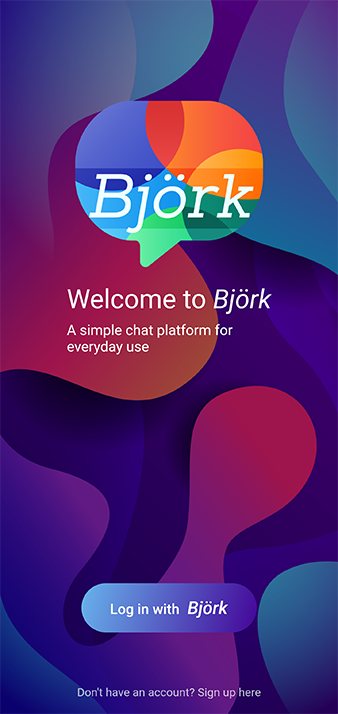

# Björk


An online chat application build with Flutter, Dart and Firestore. 


## Getting Started
1. Install [Flutter](https://flutter.io)
2. Clone the repo
3. From the terminal: Run ```flutter pub get``` OR 
   From Android Studio/IntelliJ: Click Packages get in the action ribbon at the top of pubspec.yaml.
4. Run ```flutter run --release``` (make sure to have an emulator running).

## Todo

- [ ]  **Authentication:** Passcode authentication is enabled which is needed to unlock hidden and locked chats. If your device supports fingerprint authentication, then you can use it as well.

- [ ]  **End-To-End Encryption:** Your messages are encrypted right from the moment you send it. This makes sure that only the recipient receives the message and <b>NO ONE ELSE.</b>

- [ ]  **Hide Chats:** You can hide chats to protect against prying eyes. YOU will have to authorize to unhide the chats.

- [ ]  **Lock Chats:** Hidden chats not secure enough? Lock individual chats which only open after YOU have authorized it.

- [ ]  **End Conversations:** Once you're done with a conversation, you can choose to end it, by swiping your friend's message from left to right. Doing so will delete all the conversation up until that message. 

- [ ]  **Save messages:** Double tap on any message to save it locally. Saved messages can be viewed by swiping right to left on the chat screen.

- [x]  **Minimalism UI:** The UI is uncluttered and beautiful. Gestures are used to make it pragmatic instead of using additional screen space.


## License

This project utilizes the [MIT License](https://github.com/aaronoe/FlutterCinematic/blob/master/LICENSE "Project License")
